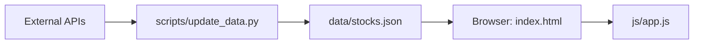

# StockScope (주식 · ETF 모니터링 대시보드)

전 세계 주식, ETF 및 크립토 지표를 한눈에 파악할 수 있는 "서버리스" 정적 대시보드입니다. Yahoo Finance와 네이버 금융에서 데이터를 수집하여 단일 JSON 파일로 캐싱하며, 별도의 백엔드 없이 브라우저만으로 동작하는 가볍고 빠른 모니터링 환경을 제공합니다.

**라이브 데모:** [https://jongh0.github.io/stock-scope/](https://jongh0.github.io/stock-scope/)

---

## 🏗 아키텍처 및 데이터 흐름

이 프로젝트는 **Static-First** 원칙을 따릅니다. 클라이언트(브라우저)에서 복잡한 API 호출을 수행하는 대신, 미리 가공된 정적 데이터를 읽어옴으로써 속도와 안정성을 극대화했습니다.



1.  **데이터 수집 (Python):** `update_data.py`가 Yahoo Finance(yfinance) 및 네이버 금융에서 최신 가격과 지표를 수집하여 `data/stocks.json`으로 통합 저장합니다.
2.  **정적 호스팅:** `index.html`과 Vanilla JS 모듈이 저장된 JSON을 fetch하여 테이블 및 차트로 렌더링합니다.
3.  **자동화:** GitHub Actions가 매시간(Hourly) 수집 스크립트를 실행하여 대시보드를 최신 상태로 유지합니다.

---

## ✨ 주요 기능

-   **다차원 지표 분석:**
    -   **수익률:** 일간(%), YoY(1년 전 대비), YTD(연초 대비) 수익률 제공
    -   **리스크/통계:** MDD(최대 낙폭), 베타(Volatility), 샤프 지수(Risk-adjusted return) 계산
    -   **밸류에이션:** PER, 배당률, 목표주가 대비 업사이드(%) 표시
-   **기술적 지표:** RSI(14) 및 MACD 시그널을 통한 과매수/과매도 상태 확인.
-   **시각화 (Sparklines):** 모든 종목에 대해 30일, 1년, 5년 기간의 추세 차트를 SVG로 즉시 렌더링.
-   **사용자 인터렉션:**
    -   **스마트 정렬:** 모든 컬럼 클릭 시 오름차순/내림차순 정렬 지원.
    -   **테마 지원:** 라이트 모드 및 다크 모드 완벽 지원.
    -   **반응형 레이아웃:** 모바일 환경에서 카드 뷰 및 스와이프 인터렉션 최적화.

---

## 🚀 빠른 시작

로컬 환경에서 대시보드를 실행하려면 정적 파일을 서빙할 간단한 웹 서버가 필요합니다.

**Windows (배치 파일):**
```bat
start.bat          # 로컬 서버 실행 (http://localhost:8080)
```

**Python (직접 실행):**
```bash
python -m http.server 8080
```

---

## 🔄 데이터 업데이트

수집 스크립트를 수동으로 실행하여 데이터를 갱신할 수 있습니다.

### 1. 의존성 설치
```bash
pip install yfinance pandas numpy requests
```

### 2. 업데이트 실행
**Windows (배치 파일):**
```bat
update.bat         # 데이터 수집 및 stocks.json 갱신
```

**Python 스크립트:**
```bash
python scripts/update_data.py
```

---

## 📂 프로젝트 구조

```text
stock-scope/
├── index.html              # 메인 UI 레이아웃 및 테이블 구조
├── css/style.css           # 대시보드 및 테마(Dark/Light) 스타일링
├── data/
│   └── stocks.json         # 가공된 전체 주식 데이터 (자동 생성됨)
├── js/
│   ├── config.js           # UI 그룹 설정 및 종목 리스트 정의
│   ├── app.js              # 데이터 로딩, 렌더링, 이벤트 핸들링 핵심 로직
│   └── sparkline.js        # SVG 기반 스파크라인 생성 모듈
├── scripts/
│   └── update_data.py      # Yahoo/Naver Finance 데이터 수집 엔진 (Python)
└── .github/workflows/
    └── update.yml          # GitHub Actions 자동 업데이트 워크플로우
```

---

## 🛠 개발 가이드

### 새로운 종목(Ticker) 추가하기
1.  **데이터 수집 등록:** `scripts/update_data.py` 파일 내 `STOCKS` 딕셔너리에 새로운 티커와 이름을 추가합니다.
2.  **UI 그룹 배치:** `js/config.js` 파일의 `GROUPS` 배열에서 원하는 카테고리에 해당 티커를 추가합니다.
3.  `update.bat`를 실행하여 `data/stocks.json`에 데이터가 정상적으로 포함되는지 확인합니다.

---

## 📊 데이터 출처

-   **Yahoo Finance (yfinance):** 글로벌 주가, 차트 히스토리, PER, 배당률, 목표주가 등
-   **네이버 금융 (Requests):** 국내 종목(KOSPI/KOSDAQ)의 PER 및 배당률 보정

---

## ⚖️ 면책 조항 (Disclaimer)

본 대시보드에서 제공하는 모든 데이터는 투자 참고용일 뿐이며, **데이터의 정확성이나 시의성을 보장하지 않습니다.** 모든 투자에 대한 책임은 투자자 본인에게 있으며, 제공된 정보를 바탕으로 한 투자 결정에 대해 제작자는 어떠한 책임도 지지 않습니다.
